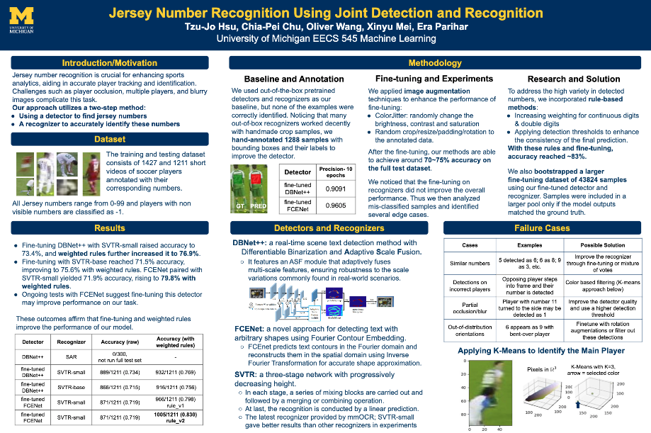
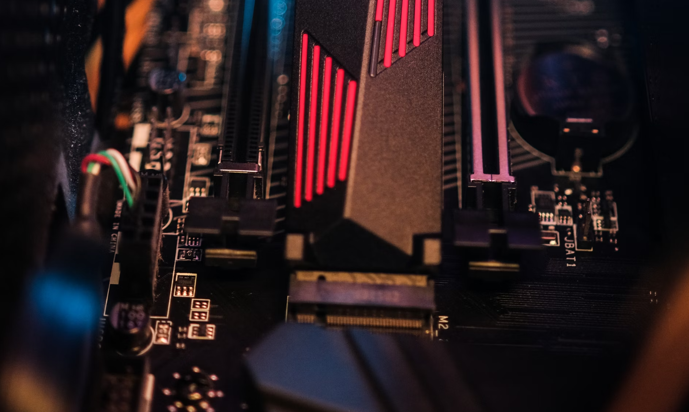

## Hi there 👋 I'm Jocelyn (Tzu-Jo) Hsu

### About Me :

🎓 I am currently pursuing a Masters Degree in Data Science at [__University of Michigan -Ann Arbor__](https://lsa.umich.edu/stats/masters_students/mastersprograms/data-science-masters-program.html). My undergraduate studies at National Yang Ming Chiao Tung University provided me with a foundation in both finance and information science.

💼 I have *2+ years* of data relevant internship/co-op/research assitant experience working with data science and machine learning.

I'm a self-motivated learner with a deep passion for data science and machine learning. I constantly seek out new challenges and opportunities to expand my expertise, whether through working on innovative projects💡, exploring the latest research📚, or mastering advanced tools and techniques 🛠️.

📚 I was a Graduate Student Instructor for the course [Information Retrieval (SI650/EECS549)](https://www.si.umich.edu/programs/courses/650) at UMSI in Fall 2024. In this role, I led engaging weekly discussions 💬, designed comprehensive course assignments 📝, and held office hours to assist students with their questions and concerns ❓.

🔭 Here are the companies where I have acquired valuable data-related experience:
 
* *Rocket Comapnies -Amrock LLC*
* *Growth Marketing (SEO and Marketing startup)*
* *NYCU Fintech Lab & Neuberger Berman*

### My Portfolio Overview:

Here you'll find a collection of projects that reflect my journey and growth in various fields in Data Science, including Predictive Modeling, Data Analysis, Natural Language Processing (NLP), Computer Vision (CV), Information Retrieval/Recommender Systems.

<h2 align = "center"> 🔮 My Generative AI/LLM Projects </h2> 

| Project | Description |
|---------|-------------|
|  | 🔷 [__Fast Inference of LLMs via Speculative Decoding__](https://github.com/tzujohsu/LLM_speculative_decoding_evaluation)    * Original inference of attention is inefficient, this project implements Speculative Decoding and Big Little Decoder (BiLD) algorithms to perform acceleration.   * Conducted experimentations with different decoding approaches, demonstrating its efficacy across various models and size ranges in tasks like multi-turn conversation, translation, RAG, and question-answering (QA). |
|  | 🚧 [__finance-podcast-RAG (ongoing)__](https://github.com/tzujohsu/finance-podcast-RAG)    * This side-project aims to build a Retrieval-Augmented Generation (RAG) system that provides financial market insight, utilizing Whisper-transcribed financial-related podcasts.   * The goal is to provide users (ME!) with a valuable tool for financial knowledge extraction and insights. |
|  | 🔷 [__Local LLM with RAG__](https://github.com/tzujohsu/local-llm-RAG)    * This placeholder is designed to quickly set up Ollama and conduct a proof of concept (POC) by launching a Retrieval-Augmented Generation (RAG) system using Large Language Models (LLMs) on my local laptop. |

<h2 align = "center"> 📈 My Predictive Modeling/Forecasting Projects </h2> 

| Project | Description |
|---------|-------------|
|  | 🔷 [__Rohlik Orders Forecasting__](https://github.com/tzujohsu/Rohlik-Orders-Forecasting)    * This project addresses challenges in the e-grocery industry: accurately predicting order volumes for Rohlik Group. The goal is to forecast the number of grocery delivery orders for selected warehouses over a 60-day period. |
|  | 🔷 [__Rossmann Sales Data Prediction__](https://github.com/tzujohsu/Rossman-Sales-Data-Prediction)    * This project aims to forecast daily sales for Rossmann drug stores across Germany using historical sales, promotion, competitor data for 1,115 Rossmann stores store. |

<h2 align = "center"> 🖥 My Computer Vision/Audio Projects </h2> 

| Project | Description |
|---------|-------------|
|  | 🔷 [__Scene Text Recognition for Jersey Number Identification__](https://github.com/tzujohsu/soccernet-jersey-number-recognition)    * Jersey number recognition is crucial for enhancing sports analytics, aiding in accurate player tracking and identification. Challenges such as player occlusion, multiple players, and blurry images complicate this task. * Our approach utilizes a two-step method: (1) Using a detector to find jersey numbers, (2) A recognizer to accurately identify these numbers. |
|  | 🔷 [__Audio Deepfake Detection with LCNN__](https://github.com/tzujohsu/audio-deepfake-detection)    * The misuse of the latest powerful generative algorithms poses a threat to individuals and society, as public opinion can be swayed through the spread of modified content, especially deepfaked audio.   * In this project, we developed a detection system using LCNN with self-Attentive Pooling layer to distinguish between bonafide and spoofed audio. |

<h2 align = "center"> 📄 My Natural Language Processing Projects </h2> 
..Coming soon..

<h2 align = "center"> 👾 Miscellaneous </h2> 

| Project | Description |
|---------|-------------|
|  | 🔷 [__Survival analysis and lifespan modeling for Hard disk drives__](https://github.com/tzujohsu/backblaze-survival-analysis)    * Conducted survival analysis on the BackBlaze hard drive failure data from 2016-2023, identifying factors for failure risks.   * Employed Kaplan-Meier and Cox regression models to evaluate reliability across manufacturers and drive capacities.|
|  | 🔷 [__Exploratory Data Analysis on 2023 US domestic Flight statistics__](https://github.com/tzujohsu/commercial-air-travel-US-EDA)    * This report examines the primary factors behind flight delays and cancellations, as well as passenger, freight and mail traffic patterns in the US domestic flight sector for 2023.   * Through exploratory data analysis of US domestic flight data, the study identifies significant trends and provide insights for strategic decision-making.  |